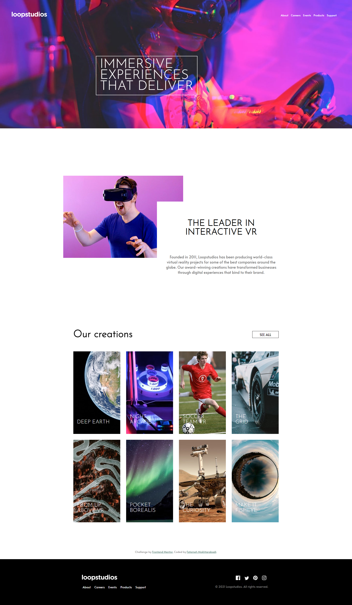

# Frontend Mentor - Loopstudios landing page solution - coded by Fatemeh Mokhtarabadi

This is a solution to the [Loopstudios landing page challenge on Frontend Mentor](https://www.frontendmentor.io/challenges/loopstudios-landing-page-N88J5Onjw). Frontend Mentor challenges help you improve your coding skills by building realistic projects.

## Table of contents

- [The challenge](#the-challenge)
- [Screenshot](#screenshot)
<!-- - [Links](#links) -->
- [My process](#my-process)
  - [Built with](#built-with)
  - [What I learned](#what-i-learned)
- [Author](#author)

### The challenge

### My work

<!--
### Links

- Solution URL: [Add solution URL here](https://your-solution-url.com)
- Live Site URL: [Add live site URL here](https://your-live-site-url.com) -->

## My process

For collecting some real-world work to put in my portfolio, FrontendMentor was the perfect place to start.

It took me 2 working days to build this, I learned a loooot! I practice some problem solving and debugging skills.
It was real fun! I started like 10 month ago by learning HTML first,
and now I'm happy for putting myself out there to do more real world work,
and to gain valuable coding and programming knowledge based on experience.

Amazing to find this helpful website! Thank you again, FrontendMentor.io!

### Built with

- Semantic HTML5 markup
- CSS pre-processor : Sass
- Flexbox
- CSS Grid
- Javascript
- Mobile-first workflow

### What I learned

I learned from the mosr tiny mistakes I accidentaly made, like when I forgot to put "px" somewhere in JS codes,
or when i wrote hover effect codes nested (this challenge was styled using Sass), which wasn't working untill I found out why.

I learned it's always good to have a good clean foundation for a webpage with the least error possibility,
because then making every other thing will be easier and more flexible. I wasn't so good with image backgrounds before.

I've also practiced work-life balance in a small scale to being more active, since as you know we sit at our desks for long hours
to have a healthy relationship with working in general and be even more happy with this job!

THE BEST THING I learned is NOT to be afraid of puting myself out there.
To start with small steps, building good habits and gain experience!

2 months from now is one year that I'm coding everyday. I'm so happy even writing this here.

## Author

- LinkedIn - [Fatemeh Mokhtarabadi](https://www.linkedin.com/in/fatemehmokhtarabadi)
- Frontend Mentor - [@Mokhtarabadi-dev](https://www.frontendmentor.io/profile/Mokhtarabadi-dev)
- Portfolio - will be here soon!
